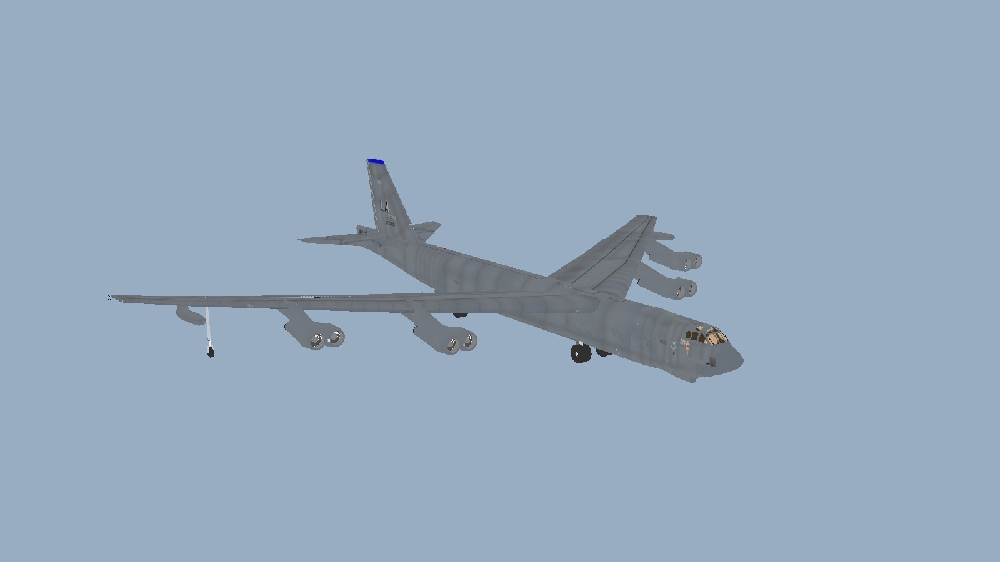
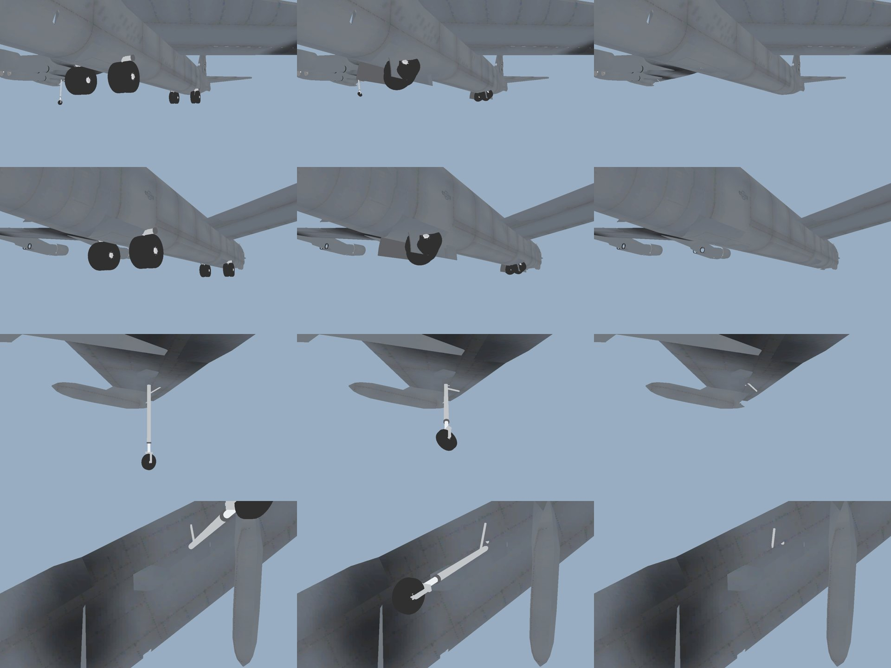

# B-52J Stratofortress for Nuclear Option

A flyable B-52 for [Nuclear Option](https://store.steampowered.com/app/2168680/Nuclear_Option/), built with
[Nikkorap's Blueprinter](https://github.com/nikkorap/NOBlueprinter-Releases/releases/latest). It uses real B-52H
airframe numbers with the B-52J modernisation: F130 engines, an AESA radar and a smart-weapon internal bay.



**Status:** work in progress, version 0.4.0. The airframe, flight model, takeoff and bombing have been tested in
game. The new landing gear, gear doors, livery support and the MALD decoys are built but not yet fully tested in
flight. Bugs are tracked in [MODLOG.md](MODLOG.md).

## Features

- **Flight model tuned to the real aircraft.**
  - Full-load takeoff run of about 2,300 m, lifting off at about 170 kt without a rotation (like the real thing).
  - Climbs above 42,000 ft and cruises around Mach 0.7–0.75 there.
  - Transonic drag rise, so it can't go supersonic in a dive.
  - Fly-by-wire tuned for a bomber, not a fighter.
- **Landing gear modelled on the B-52H.**
  - Four two-wheel main trucks and two wingtip outriggers.
  - To retract, each truck swivels 90° and folds flat into its belly well, port trucks forward and starboard trucks
    aft. The outriggers fold into the outer wing.
  - Well doors are shaped to the belly and close once the gear is down.
  - **Crosswind crab:** turn all four trucks up to 20° left or right to land crabbed into the wind.
- **Landing aids.**
  - Speedbrakes (spoilers) open at idle throttle.
  - A 44 ft drag chute deploys on the runway.
- **Custom flight deck.** Pilot and co-pilot seats, working instruments and engine gauges, and the tactical map on
  the centre display.
- **Real-world loadouts** across the internal bay and two wing pylons (Heavy Stores Adapter Beams):
  - 51 × Mk 82, 20 × JASSM-ER or 20 × ALCM, nuclear options, cluster bombs and laser-guided bombs.
  - **ADM-160 MALD / MALD-J decoys:** they show up on enemy radar as a B-52, and MALD-J also jams radars near its
    path.
  - Full list in [LOADOUTS.md](LOADOUTS.md).
- **Liveries and damage shading** work like stock aircraft. To paint your own, see [docs/LIVERIES.md](docs/LIVERIES.md).
- **Telemetry:** an optional CSV flight log for tuning and bug reports.


*Gear down, mid-retraction and stowed. The main trucks swivel and fold flat into their wells, and the outriggers fold into the wing.*

## Requirements
- Nuclear Option with BepInEx 5
- [Blueprinter](https://github.com/nikkorap/NOBlueprinter-Releases/releases/latest) 2.0.1 or newer
- Strongly recommended: [Heavy Aircraft Hangar](https://github.com/IornMan1213/NO-HeavyHangar). The B-52 is too
  big for stock hangars. Heavy Hangar adds a hangar it fits in at bases with a long runway, and spawns it
  outside the door anywhere else. It's available in the Nuclear Option Mod Manager (NOMM).

## Install
1. Download the latest release zip from [Releases](https://github.com/IornMan1213/NO-B52/releases).
2. Extract it into `Nuclear Option/BepInEx/plugins/`. You should end up with
   `BepInEx/plugins/B-52J_Stratofortress/` containing `B-52J Stratofortress_<version>.nobp` and `B52Systems.dll`.
   Remove any older B-52 `.nobp` first.
3. Install Heavy Aircraft Hangar (see Requirements).

`B52Systems.dll` is required. It keeps the airframe rigid and runs the B-52's systems: gear, chute, speedbrakes,
decoys and telemetry. Its options are in `BepInEx/config/com.ironman1213.b52systems.cfg`. Every player in a
multiplayer game needs both files.

## Flying it

| | |
|---|---|
| Speedbrakes | Throttle to idle |
| Drag chute | On the runway: throttle at idle, then hold the wheel brakes below 165 kt. It drops off below 20 kt or when you add power. |
| Crosswind crab | `[` / `]` turn the main trucks 5° left or right (max 20°), `\` straightens them. For wind from the right, crab right and keep the nose into the wind. |
| Taxi steering | Rudder (the forward trucks steer) |

**Numbers to fly by:**
- **Takeoff:** at full load, hold it on the runway and it lifts off by itself at about 170 kt. Keep the climb at 180 kt.
- **Approach:** about 150–165 kt, depending on weight. Flaps are available below 204 kt.
- **Touchdown:** about 135–145 kt.

## Building from source
The pipeline is: bohmerang's model → Blender (split into parts, gear, cockpit, texture atlas) → Unity with the
Blueprinter Editor (prefab, weapons, `.nobp`) → the BepInEx plugin. Run it with:

```bash
bash tools/build_all.sh
```

Set `BLUEPRINTER_PROJECT`, `BLENDER` and `UNITY` if yours aren't in the default locations. To install the build
into the game (close the game first):

```bash
bash tools/install.sh b52
```

[MODLOG.md](MODLOG.md) records every step, and [docs/FIELD_NOTE_nuclear-option-custom-aircraft.md](docs/FIELD_NOTE_nuclear-option-custom-aircraft.md)
covers setting up a headless Blueprinter pipeline. [SPEC.md](SPEC.md) has the flight-model and loadout numbers.

| Path | What |
|---|---|
| `tools/` | Blender scripts (`blender_prep`, `blender_gear`, `blender_cockpit`, `blender_atlas`, `blender_export`), build and install scripts, flight-model checks |
| `unity/B52Tools/Editor/` | Unity builder (`B52Builder`), weapons (`B52Weapons`), inspection and render tools |
| `plugin/B52Systems/` | Runtime plugin: rigid airframe and mass, aero centres, gear system, drag chute, speedbrakes, transonic drag, MALD-J jammer, telemetry |
| `plugin/HeavyHangar/`, `HANGAR.md` | Heavy Hangar sources (released separately as [NO-HeavyHangar](https://github.com/IornMan1213/NO-HeavyHangar)) |

## Credits
- **Base 3D model:** "Boeing B-52 Stratofortress" by **bohmerang** on Sketchfab
  (https://sketchfab.com/3d-models/boeing-b-52-stratofortress-38b0c64bd552431394efa8625d7f5144), licensed
  [CC BY 4.0](http://creativecommons.org/licenses/by/4.0/).
  - Modified: split into parts, rescaled, rigged, and the exterior textures packed into one atlas.
  - Added: landing gear, gear doors and the flight deck interior.
- **Blueprinter** by Nikkorap.
- Built with help from Claude (AI).

## License
- **B-52 airframe model and exterior textures:** a modified version of "Boeing B-52 Stratofortress" by
  [bohmerang](https://sketchfab.com/bohmerang)
  ([original](https://sketchfab.com/3d-models/boeing-b-52-stratofortress-38b0c64bd552431394efa8625d7f5144)),
  licensed [CC BY 4.0](http://creativecommons.org/licenses/by/4.0/). The full text is in
  [LICENSES/CC-BY-4.0.txt](LICENSES/CC-BY-4.0.txt), and the changes are listed in [NOTICE](NOTICE).
- **Everything else** (code, scripts, plugins and original artwork): MIT, see [LICENSE](LICENSE).

Nuclear Option belongs to Shockfront Studios. This repository and its releases contain none of the game's files.
